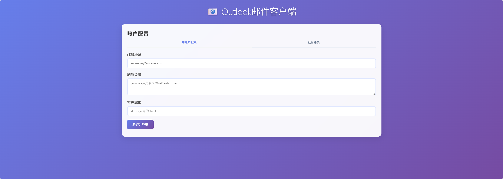
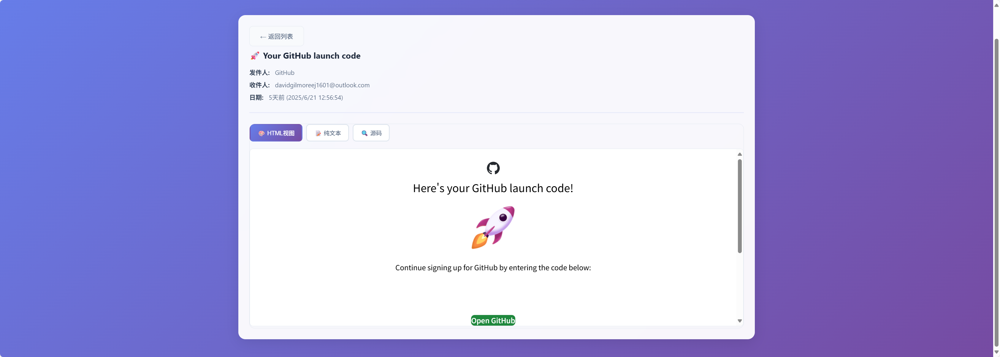
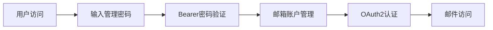

# 📨 Outlook Manager
> **outlook邮件管理服务** · 现代化OAuth2认证 · 一键Docker部署

[](https://fastapi.tiangolo.com/)
[](https://python.org/)
[](https://docker.com/)
[](https://oauth.net/)

---
## 🎨 界面预览

<table>
<tr>
<td></td>
</tr>
<tr>
<td></td>
</tr>
<tr>
<td></td>
</tr>
</table>

---

## 🚀 快速开始

### 方式一：一键部署（推荐）

```bash
# 🎯 最快启动
git clone https://github.com/oDaiSuno/OutlookManager.git && cd OutlookManager
docker compose up -d

# 🌐 访问服务
open http://localhost:8000
```

### 方式二：自动化脚本

```bash
# Linux/macOS/Windows
./deploy.sh
```

### 方式三：传统Python环境

```bash
pip install -r requirements.txt
python main.py
```

---

## 🎁 核心特性

<div align="center">

| 🔐 **企业级安全** | ⚡ **极致性能** | 🎨 **现代化UI** | 🐳 **云原生** |
|:---:|:---:|:---:|:---:|
| 极简认证体系 | 异步处理 | 响应式设计 | Docker容器化 |
| Bearer密码验证 | 智能分页 | 管理员界面 | 一键部署 |
| OAuth2认证 | 无状态验证 | 多主题支持 | 环境变量配置 |

</div>

### 📋 功能清单

#### 🔐 安全认证
- ✅ **管理员登录** - 密码保护的系统访问控制
- ✅ **Bearer密码认证** - 极简的无状态认证机制
- ✅ **直接密码验证** - 无需会话管理的简单认证
- ✅ **双层认证体系** - 管理员认证 + OAuth2邮箱认证

#### 📧 邮件管理
- ✅ **OAuth2安全认证** - 微软官方认证流程
- ✅ **多文件夹支持** - 收件箱、垃圾箱、自定义文件夹
- ✅ **双栏视图** - 同时浏览多个邮件文件夹
- ✅ **智能分页** - 灵活的分页参数，最高500封/页
- ✅ **邮件解析** - 支持HTML/纯文本双格式
- ✅ **字符编码** - 完美支持中文等多语言

#### 🚀 技术特性
- ✅ **异步高性能** - 基于FastAPI的现代化架构
- ✅ **RESTful API** - 标准化接口设计
- ✅ **交互式文档** - 自动生成的API文档
- ✅ **健康检查** - 服务状态实时监控
- ✅ **Docker容器化** - 一键部署和扩展

---

## 🔐 认证流程

### 🚀 首次访问流程

1. **访问系统** 👉 `http://localhost:8000`
2. **管理员登录** 👉 输入管理密码（默认：`admin123`）
3. **邮箱账户配置** 👉 添加Outlook账户凭证
4. **开始使用** 👉 查看和管理邮件

### 🔒 极简认证体系



- **第一层**：管理员密码直接作为Bearer令牌
- **第二层**：OAuth2保护邮箱数据访问
- **特点**：无状态、零会话管理、极简实现

---

## 🔧 API使用指南

### 🎯 快速接入

<details>
<summary><strong>🔐 0. 极简认证说明</strong></summary>

**极简认证机制**: 直接使用管理密码作为Bearer令牌，无需登录API。

所有API调用都需要在请求头中携带管理密码：
```bash
-H "Authorization: Bearer admin123"
```

**验证认证配置**:
```bash
curl "http://localhost:8000/auth/config" \
  -H "Authorization: Bearer admin123"
```

**响应示例**:
```json
{
  "auth_type": "bearer_password",
  "password_hashed": false
}
```

</details>

<details>
<summary><strong>📝 1. 注册账户</strong></summary>

```bash
curl -X POST "http://localhost:8000/accounts" \
  -H "Content-Type: application/json" \
  -H "Authorization: Bearer admin123" \
  -d '{
    "email": "your_email@outlook.com",
    "refresh_token": "your_refresh_token",
    "client_id": "your_client_id"
  }'
```

**响应示例**:
```json
{
  "email_id": "your_email@outlook.com",
  "message": "Account verified and saved successfully."
}
```

</details>

<details>
<summary><strong>📬 2. 获取邮件列表</strong></summary>

```bash
# 获取所有邮件（智能聚合）
curl "http://localhost:8000/emails/your_email@outlook.com?folder=all&page=1&page_size=100" \
  -H "Authorization: Bearer admin123"

# 仅收件箱
curl "http://localhost:8000/emails/your_email@outlook.com?folder=inbox" \
  -H "Authorization: Bearer admin123"

# 仅垃圾箱
curl "http://localhost:8000/emails/your_email@outlook.com?folder=junk" \
  -H "Authorization: Bearer admin123"
```

**响应示例**:
```json
{
  "email_id": "your_email@outlook.com",
  "folder_view": "all",
  "page": 1,
  "page_size": 100,
  "total_emails": 1247,
  "emails": [...]
}
```

</details>

<details>
<summary><strong>📖 3. 获取邮件详情</strong></summary>

```bash
curl "http://localhost:8000/emails/your_email@outlook.com/INBOX-12345" \
  -H "Authorization: Bearer admin123"
```

**响应示例**:
```json
{
  "message_id": "INBOX-12345",
  "subject": "重要：项目进展更新",
  "from_email": "sender@company.com",
  "to_email": "your_email@outlook.com",
  "date": "2024-01-20T10:30:00Z",
  "body_plain": "邮件正文...",
  "body_html": "<html>...</html>"
}
```

</details>

### 🔍 交互式API文档

访问 `http://localhost:8000/docs` 体验完整的交互式API文档

---

## 🐳 Docker部署详情

### ⚙️ 环境配置

```bash
# 基础服务配置
HOST=0.0.0.0          # 监听地址
PORT=8000             # 监听端口
WORKERS=1             # 工作进程数
LOG_LEVEL=info        # 日志级别

# 🔐 安全认证配置
ADMIN_PASSWORD=admin123                    # 管理员密码
```

**安全提醒**:
- 🚨 **生产环境中请务必修改默认密码**
- 🔒 **支持bcrypt哈希密码（推荐）**
- 🌐 **HTTPS部署时更安全**

### 🗂️ 数据卷映射

```yaml
volumes:
  - ./data:/app/data                    # 应用数据
  - ./accounts.json:/app/accounts.json  # 账户凭证
```

### 🛠️ 管理命令

```bash
# 查看状态
docker compose ps

# 实时日志
docker compose logs -f

# 滚动更新
docker compose pull && docker compose up -d

# 完全重置
docker compose down -v && docker compose up -d
```

---

**⭐ 如果这个项目对你有帮助，请给我们一个星标！**

[](https://www.star-history.com/#oDaiSuno/OutlookManager&Date)