# 📨 Outlook Manager
> **outlook邮件管理服务** · 现代化OAuth2认证 · 一键Docker部署

[](https://fastapi.tiangolo.com/)
[](https://python.org/)
[](https://docker.com/)
[](https://oauth.net/)

---


## 📈 更新日志

### v2.1.0 (2025-07-01) - 修复若干bug，增加一键复制功能


----
### v2.0.0 (2025-06-27) - 邮箱管理系统，性能优化


<details>
<summary><strong>详细内容</strong></summary>

#### 🎨 用户体验升级
- **邮箱快速切换** - 邮件界面新增下拉选择器，无需退出登录
- **账户管理按钮** - 一键返回账户管理，提升操作流程
- **智能状态显示** - 实时显示账户有效性，支持颜色标识
- **批量操作增强** - 支持批量验证、导入、删除账户
- **搜索筛选功能** - 账户搜索和状态筛选，快速定位

#### 🚀 性能优化
- **IMAP连接池** - 新增连接复用机制，减少认证开销
- **邮件缓存系统** - 5分钟智能缓存，重复访问速度提升60%+
- **批量获取优化** - FLAGS字段优化，邮件头获取效率显著提升
- **异步文件IO** - 文件操作移至线程池，避免阻塞主线程
- **原子写入机制** - 临时文件+移动操作，防止并发写入损坏

#### 🔧 技术改进
- **前端渲染优化** - DocumentFragment减少DOM操作
- **加载动画增强** - 统一的Spinner组件和状态管理
- **错误处理完善** - 友好的错误提示和状态恢复
- **响应式设计** - 移动端邮箱切换器布局优化

#### 🛡️ 稳定性提升
- **连接状态管理** - 优化IMAP连接生命周期
- **异常处理机制** - 完善的错误捕获和恢复逻辑
- **内存使用优化** - 减少内存占用和潜在内存泄漏
</details>

---

## 🎨 界面预览

<table>
<tr>
<td></td>
</tr>
<tr>
<td></td>
</tr>
<tr>
<td></td>
</tr>
</table>

---

## 🚀 快速开始

### 方式一：一键部署（推荐）

```bash
# 🎯 最快启动
git clone https://github.com/oDaiSuno/OutlookManager.git && cd OutlookManager
docker compose up -d

# 🌐 访问服务
open http://localhost:8000
```

### 方式二：自动化脚本

```bash
# Linux/macOS/Windows
./deploy.sh
```

### 方式三：传统Python环境

```bash
pip install -r requirements.txt
python main.py
```

---

## 🎁 核心特性

<div align="center">

| 🔐 **企业级安全** | ⚡ **极致性能** | 🎨 **现代化UI** | 🐳 **云原生** |
|:---:|:---:|:---:|:---:|
| 极简认证体系 | 异步处理 | 响应式设计 | Docker容器化 |
| Bearer密码验证 | 智能分页 | 管理员界面 | 一键部署 |
| OAuth2认证 | 邮件缓存 | 多主题支持 | 环境变量配置 |

</div>

### 📋 功能清单

#### 🔐 安全认证
- ✅ **管理员登录** - 密码保护的系统访问控制
- ✅ **Bearer密码认证** - 极简的无状态认证机制
- ✅ **直接密码验证** - 无需会话管理的简单认证
- ✅ **双层认证体系** - 管理员认证 + OAuth2邮箱认证

#### 📧 邮件管理
- ✅ **OAuth2安全认证** - 微软官方认证流程
- ✅ **多文件夹支持** - 收件箱、垃圾箱、自定义文件夹
- ✅ **双栏视图** - 同时浏览多个邮件文件夹
- ✅ **智能分页** - 灵活的分页参数，最高500封/页
- ✅ **邮件解析** - 支持HTML/纯文本双格式
- ✅ **字符编码** - 完美支持中文等多语言
- ✅ **快速切换** - 邮件界面直接切换多个邮箱账户
- ✅ **邮件缓存** - 5分钟智能缓存提升加载速度

#### 🚀 技术特性
- ✅ **异步高性能** - 基于FastAPI的现代化架构
- ✅ **RESTful API** - 标准化接口设计
- ✅ **交互式文档** - 自动生成的API文档
- ✅ **健康检查** - 服务状态实时监控
- ✅ **Docker容器化** - 一键部署和扩展
- ✅ **连接池优化** - IMAP连接复用提升性能
- ✅ **原子文件操作** - 数据安全保障

#### 🎨 用户体验
- ✅ **响应式设计** - 完美适配桌面和移动设备
- ✅ **实时状态** - 账户活性状态智能检测
- ✅ **批量操作** - 支持批量添加、验证、删除账户
- ✅ **搜索筛选** - 账户搜索和状态筛选
- ✅ **动画效果** - 流畅的加载和切换动画
- ✅ **错误处理** - 友好的错误提示和恢复机制

---

## 🔐 认证流程

### 🚀 首次访问流程

1. **访问系统** 👉 `http://localhost:8000`
2. **管理员登录** 👉 输入管理密码（默认：`admin123`）
3. **邮箱账户配置** 👉 添加Outlook账户凭证
4. **开始使用** 👉 查看和管理邮件

### 🔒 极简认证体系

```mermaid
graph LR
    A[用户访问] --> B[输入管理密码]
    B --> C[Bearer密码验证]
    C --> D[邮箱账户管理]
    D --> E[OAuth2认证]
    E --> F[邮件访问]
```



- **第一层**：管理员密码直接作为Bearer令牌
- **第二层**：OAuth2保护邮箱数据访问
- **特点**：无状态、零会话管理、极简实现

---

## 🔧 API使用指南

### 🎯 快速接入

<details>
<summary><strong>🔐 0. 极简认证说明</strong></summary>

**极简认证机制**: 直接使用管理密码作为Bearer令牌，无需登录API。

所有API调用都需要在请求头中携带管理密码：
```bash
-H "Authorization: Bearer admin123"
```

**验证认证配置**:
```bash
curl "http://localhost:8000/auth/config" \
  -H "Authorization: Bearer admin123"
```

**响应示例**:
```json
{
  "auth_type": "bearer_password",
  "password_hashed": false
}
```

</details>

<details>
<summary><strong>📝 1. 注册账户</strong></summary>

**单个账户注册**:
```bash
curl -X POST "http://localhost:8000/accounts" \
  -H "Content-Type: application/json" \
  -H "Authorization: Bearer admin123" \
  -d '{
    "email": "your_email@outlook.com",
    "refresh_token": "your_refresh_token",
    "client_id": "your_client_id"
  }'
```

**批量账户注册**:
```bash
curl -X POST "http://localhost:8000/accounts" \
  -H "Content-Type: application/json" \
  -H "Authorization: Bearer admin123" \
  -d '[
    {
      "email": "user1@outlook.com",
      "refresh_token": "token1",
      "client_id": "client1"
    },
    {
      "email": "user2@outlook.com", 
      "refresh_token": "token2",
      "client_id": "client2"
    }
  ]'
```

**响应示例**:
```json
{
  "email_id": "your_email@outlook.com",
  "message": "Account verified and saved successfully."
}
```

</details>

<details>
<summary><strong>📊 2. 账户管理</strong></summary>

**获取账户列表**:
```bash
# 基础列表
curl "http://localhost:8000/accounts" \
  -H "Authorization: Bearer admin123"

# 检查活性状态
curl "http://localhost:8000/accounts?check_status=true" \
  -H "Authorization: Bearer admin123"
```

**批量验证账户**:
```bash
curl -X POST "http://localhost:8000/accounts/verify" \
  -H "Content-Type: application/json" \
  -H "Authorization: Bearer admin123" \
  -d '{
    "accounts": [
      {
        "email": "test@outlook.com",
        "refresh_token": "token",
        "client_id": "client_id"
      }
    ]
  }'
```

**批量删除账户**:
```bash
curl -X DELETE "http://localhost:8000/accounts" \
  -H "Content-Type: application/json" \
  -H "Authorization: Bearer admin123" \
  -d '{
    "emails": ["user1@outlook.com", "user2@outlook.com"]
  }'
```

</details>

<details>
<summary><strong>📬 3. 获取邮件列表</strong></summary>

```bash
# 获取所有邮件（智能聚合）
curl "http://localhost:8000/emails/your_email@outlook.com?folder=all&page=1&page_size=100" \
  -H "Authorization: Bearer admin123"

# 仅收件箱
curl "http://localhost:8000/emails/your_email@outlook.com?folder=inbox" \
  -H "Authorization: Bearer admin123"

# 仅垃圾箱
curl "http://localhost:8000/emails/your_email@outlook.com?folder=junk" \
  -H "Authorization: Bearer admin123"

# 双栏视图（推荐）
curl "http://localhost:8000/emails/your_email@outlook.com/dual-view?inbox_page=1&junk_page=1&page_size=20" \
  -H "Authorization: Bearer admin123"
```

**响应示例**:
```json
{
  "email_id": "your_email@outlook.com",
  "folder_view": "all",
  "page": 1,
  "page_size": 100,
  "total_emails": 1247,
  "emails": [...]
}
```

</details>

<details>
<summary><strong>📖 4. 获取邮件详情</strong></summary>

```bash
curl "http://localhost:8000/emails/your_email@outlook.com/INBOX-12345" \
  -H "Authorization: Bearer admin123"
```

**响应示例**:
```json
{
  "message_id": "INBOX-12345",
  "subject": "重要：项目进展更新",
  "from_email": "sender@company.com",
  "to_email": "your_email@outlook.com",
  "date": "2024-01-20T10:30:00Z",
  "body_plain": "邮件正文...",
  "body_html": "<html>...</html>"
}
```

</details>

### 🔍 交互式API文档

访问 `http://localhost:8000/docs` 体验完整的交互式API文档

---

## 🚀 性能优化

### ⚡ 后端优化
- **IMAP连接池** - 复用连接减少认证开销
- **邮件列表缓存** - 5分钟智能缓存机制
- **批量获取优化** - FLAGS字段优化和批量处理
- **异步文件IO** - 线程池处理文件读写操作
- **原子写入** - 防止并发写入时数据损坏

### 🎨 前端优化
- **DocumentFragment渲染** - 减少DOM操作提升性能
- **动画优化** - 流畅的加载和切换动画
- **状态管理** - 智能加载状态防止重复请求
- **响应式设计** - 完美适配各种设备尺寸

### 📊 性能特点
- **邮件加载速度** - 相比原版提升60%以上
- **账户切换** - 无需退出登录，秒级切换
- **缓存命中率** - 重复访问缓存命中率95%+
- **并发处理** - 支持高并发邮件读取

---

## 🎨 用户界面特性

### 📱 邮件管理界面
- **邮箱切换器** - 下拉选择器快速切换邮箱
- **账户管理按钮** - 一键返回账户管理页面
- **状态标识** - 实时显示账户有效性状态
- **双栏视图** - 同时查看收件箱和垃圾邮件

### 🛠️ 账户管理界面
- **批量操作** - 支持批量验证、导入、删除
- **状态筛选** - 按有效性筛选账户列表
- **搜索功能** - 快速定位特定邮箱账户
- **实时状态** - 账户活性状态实时检测

### 📋 批量登录功能
- **格式验证** - 智能解析批量账户信息
- **并行验证** - 多账户并行验证提升效率
- **选择性导入** - 仅导入验证成功的账户
- **详细反馈** - 每个账户的验证结果展示

---

## 🐳 Docker部署详情

### ⚙️ 环境配置

```bash
# 基础服务配置
HOST=0.0.0.0          # 监听地址
PORT=8000             # 监听端口
WORKERS=1             # 工作进程数
LOG_LEVEL=info        # 日志级别

# 🔐 安全认证配置
ADMIN_PASSWORD=admin123                    # 管理员密码
```

**安全提醒**:
- 🚨 **生产环境中请务必修改默认密码**
- 🔒 **支持bcrypt哈希密码（推荐）**
- 🌐 **HTTPS部署时更安全**

### 🗂️ 数据卷映射

```yaml
volumes:
  - ./data:/app/data                    # 应用数据
  - ./accounts.json:/app/accounts.json  # 账户凭证
```

### 🛠️ 管理命令

```bash
# 查看状态
docker compose ps

# 实时日志
docker compose logs -f

# 滚动更新
docker compose pull && docker compose up -d

# 完全重置
docker compose down -v && docker compose up -d
```

---

**⭐ 如果这个项目对你有帮助，请给我们一个星标！**

[](https://www.star-history.com/#oDaiSuno/OutlookManager&Date)